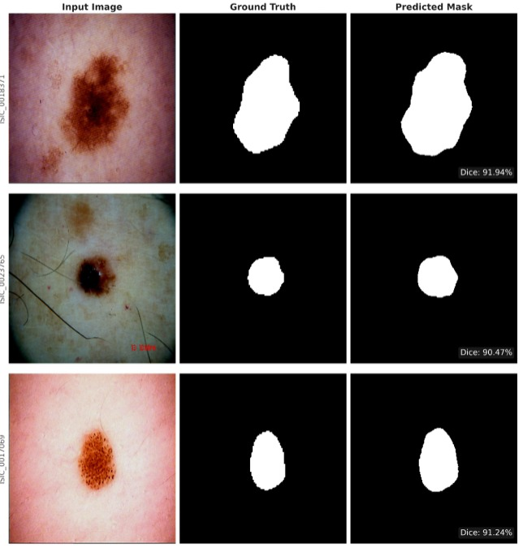
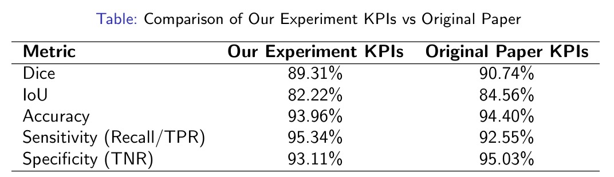

# MobileUNETR

MobileUNETR is a lightweight hybrid CNN-Transformer model for medical image segmentation. It takes a medical image as input and predicts a pixel-level mask of the target region.

## How It Works

The project follows an encoder-decoder architecture:

1. **Input:** A medical image is provided to the model.
2. **Feature Extraction:** The hybrid CNN-Transformer encoder extracts local and global features.
3. **Feature Fusion:** The decoder combines features from different resolutions.
4. **Mask Prediction:** The decoder generates a segmentation mask.
5. **Output:** The predicted mask highlights the target region in the image.

## Project Workflow

**Dataset → Preprocessing → Model Training → Validation → Segmentation Prediction**

The model is trained using medical images and their corresponding ground-truth masks. During training, the predicted masks are compared with the ground-truth masks to calculate the loss and update the model.

After training, the model can be used to predict segmentation masks for new medical images.

## Dataset Preparation

The project uses medical image datasets such as ISIC and PH2.

Prepare `train.csv` and `test.csv` containing the paths to the input images and their corresponding masks.

Example:

| image | mask |
| --- | --- |
| path/to/image1.jpg | path/to/mask1.png |
| path/to/image2.jpg | path/to/mask2.png |

Update the dataset paths in the experiment's `config.yaml` file before training.

## Running the Project

```bash
cd MobileUNETR
cd experiments/isic_2016/exp_2_dice_b8_a2/
CUDA_VISIBLE_DEVICES="0" accelerate launch run_experiment.py
```

Training parameters such as batch size, learning rate, and epochs can be configured in `config.yaml`.

The project displays training loss, validation loss, and Dice score during training.

## Example Results

The following examples show the input image, ground-truth mask, and predicted mask.

<p align="center">
  
</p>

## Experiment Performance

The following table shows the comparison between our experiment and the original paper.

<p align="center">
  
</p>

## Model Usage

The model can also be used independently through `mobileunetr.py`.

```python
from mobileunetr import build_mobileunetr_xxs
import torch

model = build_mobileunetr_xxs(num_classes=1, image_size=512)

data = torch.randn((4, 3, 512, 512))
output = model(data)

print(output.shape)
```

## Summary

MobileUNETR combines CNNs and Transformers to extract useful features from medical images and generate segmentation masks. The project can be trained on medical image datasets and used to predict target regions in new images.